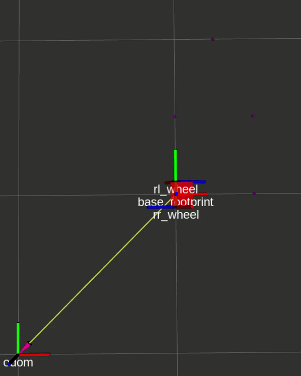

# ME495 Sensing, Navigation, and Machine Learning
## Data acquisition: rotational, linear and waypoint-reaching movements
Author: Maurice Rahme

| Motion | Fv  | Av  | ET  | EX  | EY  | OT  | OX  | OY  | FT  | FX  | FY  | GT  | GX  | GY  | DT  | DX  | DY  |
| ------ | --- | --- | --- | --- | --- | --- | --- | --- | --- | --- | --- | --- | --- | --- | --- | --- | --- | 
|  CCW   |  1  | 2.84|  0  |  0  |  0  |  152.142  |  0  |  0  | 43.032    | 0   | 0   | 120 | 0   | 0   | 1.6071 | 0 | 0 | 
|  CW    |  1  | 2.84|  0  |  0  |  0  |  58.514   |  0  |  0  | 40.32     | 0   | 0   | 30  | 0   | 0   | 1.4257 | 0 | 0 | 
|  FWD   |  1  | 0.22|  0  |  2  |  0  |  19.56    |  1.81     |  0.32     | 0   | 1.98| 0   | 20  |1.8  | 0.27| 0.022| 0.001 | 0.005 | 
|  BWD   |  1  | 0.22|  0  |  2  |  0  |  2.5      |  1.84     |  0.04     | 0   | 1.98| 0   | 3   | 1.81| 0.006  | 0.025 | 0.003 | 0.002 | 
|  CCW   | 0.2 |0.568|  0  |  0  |  0  |  70       |  0  | 0   | 4.5       | 0   | 0   | 60  | 0   | 0   | 0.5 | 0| 0 | 
|  CW    | 0.2 |0.568|  0  |  0  |  0  |  67.45    |  0  | 0   | 5.6       | 0   | 0   | 50  | 0   | 0   | 0.8725 | 0 | 0 | 
|  FWD   | 0.2 |0.044|  0  |  2  |  0  |  0.4      |  2.05     | 0.006     | 0   |1.995| 0   | 0   | 2.03| 0   | 0.02 | 0.002 | 0.006 | 	
|  BWD   | 0.2 |0.044|  0  |  2  |  0  |  0.4      |  2.05     | 0.006     | 0   |1.995| 0   | 0   | 2.02| 0   | 0.02 | 0.003 | 0.0006|		

The estimated odometry pose was generally much closer to the measured pose than that produced by the feedforward model. This occurs because the forward model does not account for wheel slip, how well the motor commands are followed (I noticed that even with the turtlebot3 propped up on a brick, the motors did not rotate by the same amount when given the same commands), as well as the accelertion and deceleation of the turtlebot3. Reducing `frac_vel` resulted in much lower drift, as can be seen in the table above.

After tracing the five waypoints at coordinates `[[1, 1], [1.5, 1], [1.5, 1.5], [1.25, 2], [1, 1.5]]`, the turtlebot3 traveled 2.46 meters, as opposed to the expected 2.5, and was off from the first/last waypoint by 0.115m in the x direction, and 0.04m in the y diretion. This was accomplished with a `frac_vel` of 0.2.

Below is a video of the turtlebot3 tracing the waypoints, along with its counterpart in simulation.

Here is another video of the same trajectory, but with markers being layed out to outline the path. Note that the turtlebot believes it has completed the trajectory nearly perfectly (within the set threshold).

