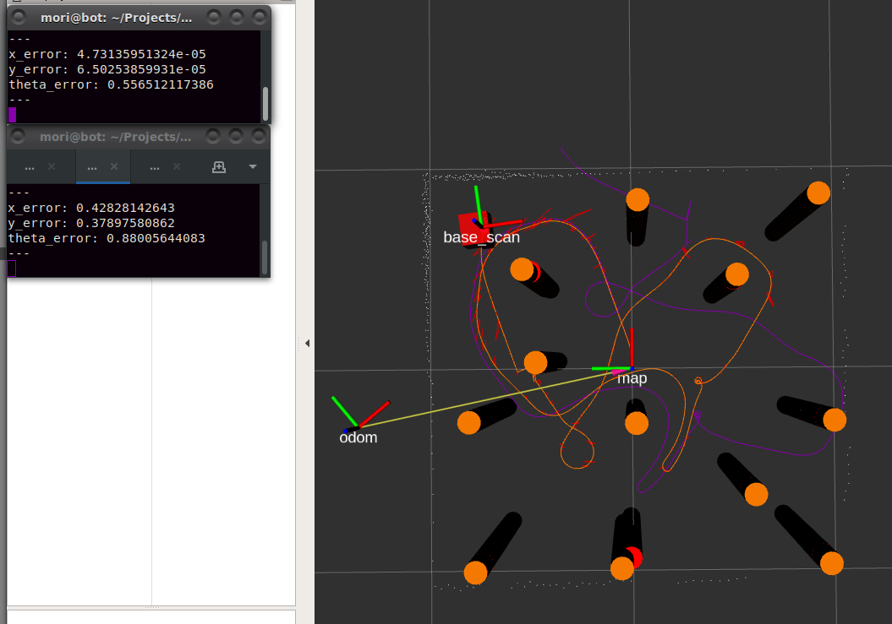

# Error between Odometry and Ground Truth:
x_error: 0.442805081606
y_error: 0.368803560734
theta_error: 0.879850745201

# Error between EKF SLAM and Ground Truth:
x_error: 7.48365755499e-06
y_error: 0.00057053467026
theta_error: 0.494665533304

## Noise: 0.001
## Detection Radius: 1.0 m

