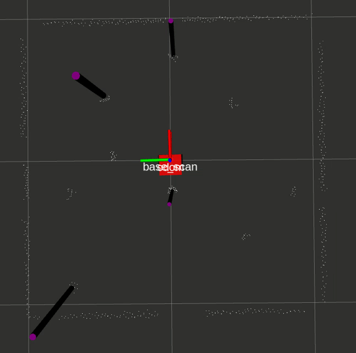

# Package: nuslam
Author: Maurice Rahme

## Package Summary

This incorporates feature detection on the Turtlebot3's LiDAR, as well as EKF SLAM with Unknown Data Association using the Mahalanobis Distance.

EKF SLAM with LiDAR Measurements:

EKF SLAM with Gazebo Landmarks:

**KEY**
* Gazebo Data: Orange
* Odometry/Sensor Data: Purple
* SLAM Data: Red

Feature Detection:

## Launch Instructions

Run `roslaunch <package_name> <launchfile.launch> --ros-args` to view any optional arguments and their instructions.

Run `roslaunch nuturtle_robot landmarks.launch` to launch the feature detection node.

Run `roslaunch nuturtle_robot slam.launch debug:=True/False` to launch the EKF SLAM node using LiDAR data (False) or Gazebo data (True) for landmarks. Also launches Turtlebot3 teleop node.

## landmarks.hpp/cpp

Contains the `Landmark` class used for feature detection.

## landmarks_node.cpp

Contains the node implementation of feature detection.

## ekf.hpp/cpp

Contains the EKF class used for EKF SLAM with Unknown Data Association.

## slam.cpp

Contains the node implementation of EKF SLAM with Unknown Data Association.
