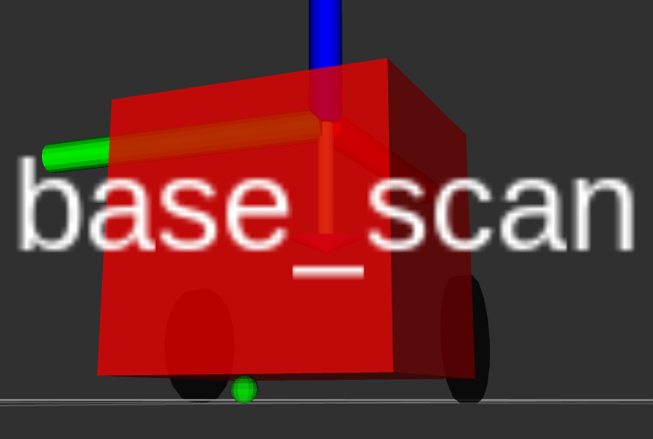

# Package: nuturtle_description
Author: Maurice Rahme

## Package Summary

This package houses the description of a differential drive robot with a caster wheel for support. The robot is viewable in `RViz` using `view_diff_drive.launch`.

## Launch Instructions

Run `roslaunch nuturtle_description view_diff_drive.launch --ros-args` to view any optional arguments and their instructions.

Run `roslaunch nuturtle_description view_diff_drive.launch` to view the differential drive robot in RViz alongside the joint state publisher GUI, which allows you to control the rear wheel joint angles.

Run `roslaunch nuturtle_description view_diff_drive.launch jsp_gui:=0` to view the robot without the GUI.

## diff_params.yaml

This file loads the differential drive robot's parameters into the parameter server.

* `wheel_width`: the width of the rear wheels.
* `wheel_radius`: the radius of the rear wheels.
* `wheel_base`: the distance betweem the centres of the wheels.
* `chassis_length`: the length of the main chassis link.
* `chassis_thickness`: the thickness of the plate that forms the chassis.

## diff_drive_macro.xacro

This file contains `macros` which describe generic bodies and joints required for the robot for modularity and brevity.

* `xacro:macro name="wheel_joint"`: describes a wheel joint used for the wheels.
* `xacro:macro name="frame_joint"`: describes a joint which holds the `base_link` frame to the `base_footprint` frame.
* `xacro:macro name="r_box"`: describes a generic rectangular prism, used for the chassis.
* `xacro:macro name="r_cyl"`: describes generic cylindres, used for the rear wheels.
* `xacro:macro name="r_sph"`: describes a generic sphere, used for the ball caster support.

## diff_drive.urdf.xacro

This file loads `diff_drive_macro.xacro` as well as `diff_params.yaml` to create a `URDF` description of the robot modularly.

## ddrive_bl.rviz

This `RViz` config file saves a view which hides all frames except `base_link` and `rl_wheel`.

## ddrive.rviz

This `RViz` config file shows the differential drive robot with all its frames.

## view_diff_drive.launch

This launchfile starts by loading the robot's description through `diff_drive.urdf.xacro`, alongside the robot and joint state publishers, which are necessary to display the robot in `RViz`. It has an optional parameter `use_jsp_gui` that defaults to true to show the joint state publisher GUI, which allows the user to control the robot's wheel joint angles. Next, it loads the paramters from `diff_params.yaml` into the parameter server, and calls the `RViz` node along with the `ddrive_bl.rviz` config file to show the robot with only its `base_link` and `rl_wheel` frames visible.
