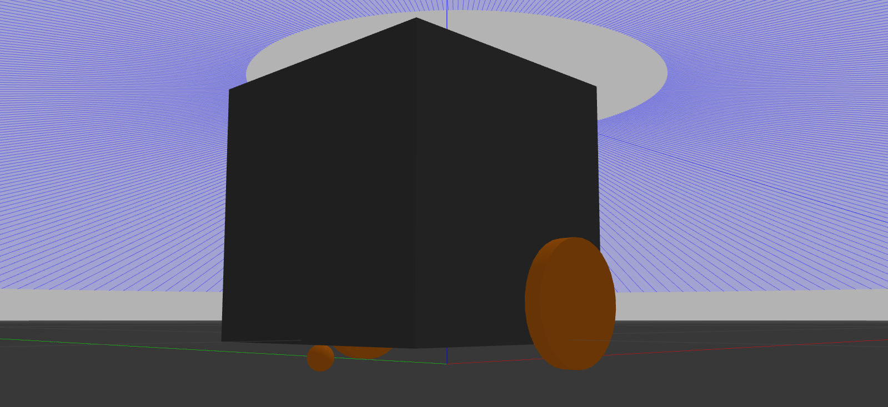

# ME495 Sensing, Navigation, and Machine Learning
# Package: nuturtle_gazebo
Author: Maurice Rahme

## Package Summary

This package simulates a differential drive robot in Gazebo with a custom plugin for low-level controls identical to what is available on a real Turtlebot3.

## Launch Instructions

Run `roslaunch <package_name> <launchfile.launch> --ros-args` to view any optional arguments and their instructions.

Run `roslaunch nuturtle_gazebo diff_drive_gazebo.launch` to spawn the differential drive robot in Gazebo with a LiDAR

Run `roslaunch nuturtle_gazebo gazebo_waypoints.launch` to make the robot follow 5 waypoints with visualization in RViz.

## turtle_drive_plugin.cpp

This plugin provides the user with low-level control over the differential drive robot's wheel speed and encoder readings akin to what is available on a real Turtlebot3. You can edit the input parameters in `diff_drive.gazebo.xacro` under the `urdf` directory.
