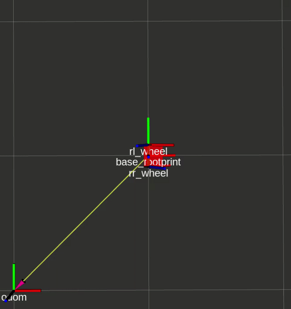

# Package: nuturtle_robot
Author: Maurice Rahme

## Package Summary

This package is an illustrative example of how to control the Turtlebot3 using low-level actuation and sensing.

## Launch Instructions

Run `roslaunch <package_name> <launchfile.launch> --ros-args` to view any optional arguments and their instructions.

Run `roslaunch nuturtle_robot basic_remote.launch robot:=X` to enable serial communication and actuate the LiDAR scanner on the Turtlebot3. Substitute `X` with the turtlebot number you are controlling (1-5).

Run `roslaunch nuturtle_robot follow_waypoints.launch` to make the robot follow 5 waypoints with visualization in RViz.

Run `roslaunch nuturtle_robot test_movement.launch` to enable services to allow the robot to perform pure rotational and translational motions for data acquisition.

## turtle_interface.cpp

This is the main useful node in the package. It converts Twists to wheel commands and reads encoder values and converts them to wheel angles. It works both on the real Turtlebot3 and in the Gazebo implementation.

## rotation.cpp

This node provides services to allow the Turtlebot3 to perform pure rotations(CW/CCw) or translations (FWD/BWD).

## real_waypoint.cpp

This node allows the Turtlebot3 (real or sim) to follow a user-specified number of waypoints using closed-loop bang-bang control with the wheel encoder readings as an input.
